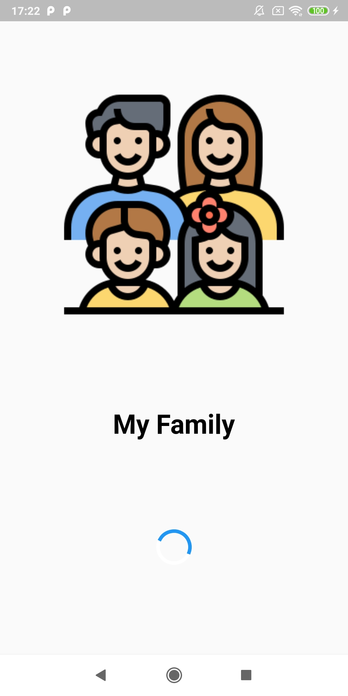
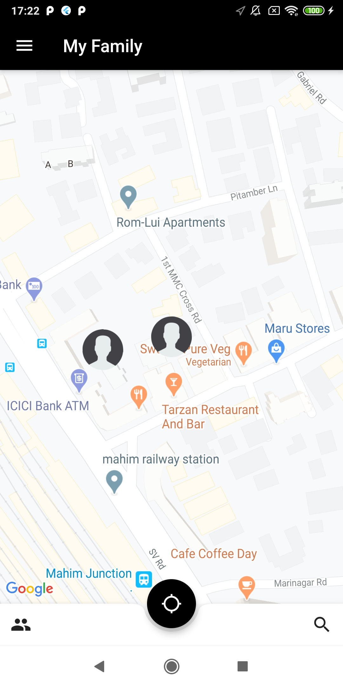
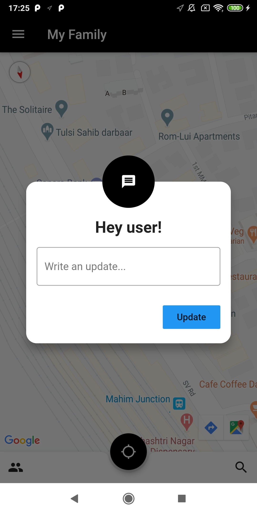
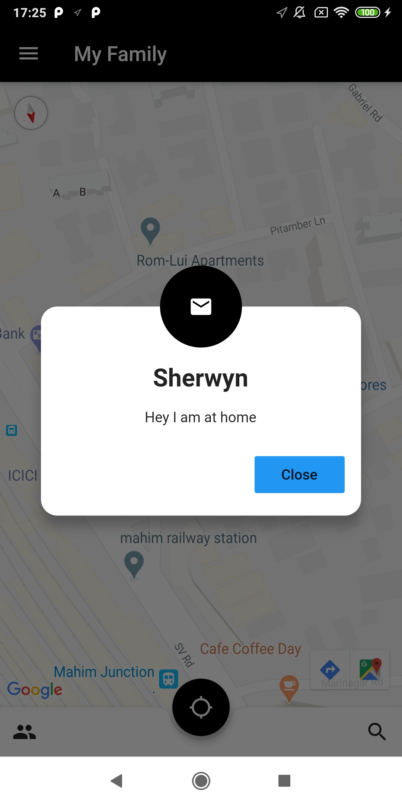

# My-Family

<div style="text-align:center;">
  
An app to keep track of your family members at anytime of the day to ensure their safety

<br>

© 2020 Sherwyn D'souza
</div>

<br>

# Getting Started

1. Clone the repository

```bash
git clone <this_repo_url>
```
2. From the root folder, `My-Family`, run the Flutter application

```bash
flutter run
```

> Use `--release` for release build

<br>

# Working Demonstration


<br>

# Flutter Application










